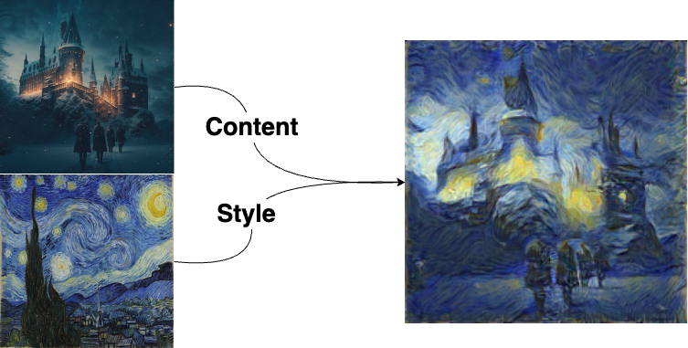

# Machine Learning

This repository was made for documenting the practical assignments and final project of the CE477: Machine Learning course.
I will be uploading my answers to the assignments as they get released throughout the semester.

## Homeworks
You can find the homework assignments in their respective folders: [HW1](https://github.com/Sinanmz/MachineLearning/tree/main/HW1), [HW2](https://github.com/Sinanmz/MachineLearning/tree/main/HW2), [HW3](https://github.com/Sinanmz/MachineLearning/tree/main/HW3), [HW4](https://github.com/Sinanmz/MachineLearning/tree/main/HW4), and [HW5](https://github.com/Sinanmz/MachineLearning/tree/main/HW5).
The final project details and progress can be found in the FinalProject folder.

## Final Project
The final project details can be found in the [Final Project](https://github.com/Sinanmz/MachineLearning/tree/main/FinalProject) folder.

